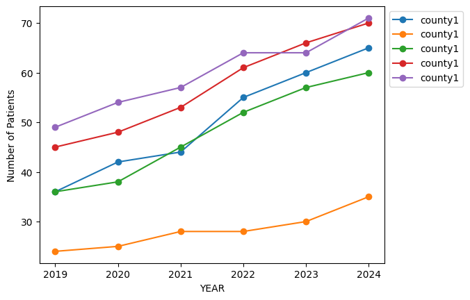
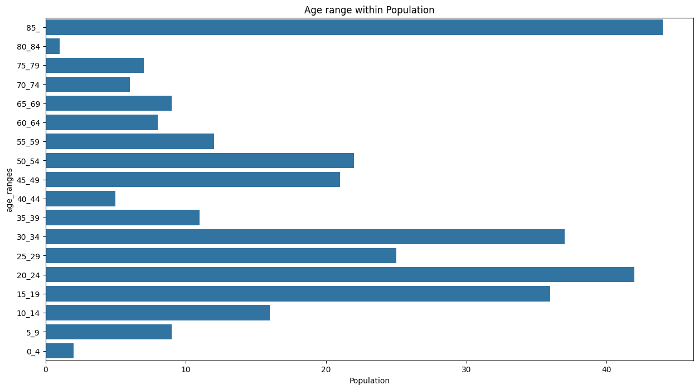
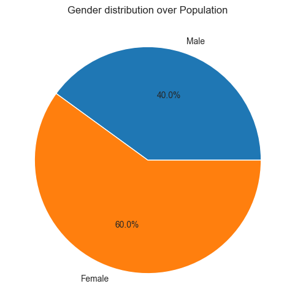

```python
# load dependencies
import numpy as np
import pandas as pd 
import matplotlib.pyplot as plt
import seaborn as sns
import datetime
pd.set_option("display.precision", 2)


# Read the data in .csv
df = pd.read_csv("synthetic_ehr.csv")
print(f' df_shape: {df.shape}')
print(f'df_columns: {df.columns}')
df.head()

# we assume the clinics are spread over 5 counties: 
lst_clinic_names = list(df['clinic_name'].drop_duplicates())
county_dic = {'county1':lst_clinic_names[:20], 'county2':lst_clinic_names[20:40], 
              'county3':lst_clinic_names[40:60], 'county4':lst_clinic_names[60:80], 'county5':lst_clinic_names[80:] }
county = ['county1','county2','county3','county4','county5']


## Find min max consultation_date
# to find date information from counties
# County1
datel = list(df[df['clinic_name'].isin(county_dic['county1'])].consultation_date.drop_duplicates())
datelp = []
for i in datel:
    s = str(i)
    year = s[:4]
    month = s[4:6]
    day = s[6:]
    date = year+'-'+month+'-'+day
    datelp.append(date)
print(f'Data range for county1 spans from: {min(datelp)} to {max(datelp)}')


# calculate the population for the last five years, for each county: 
year = [2019, 2020,2021, 2022, 2023,2024]
dataa = []
pop_dic = {'county1':[],'county2':[],'county3':[],'county4':[],'county5':[]}
for c in county:
    dataa = []
    #for yr < 1800:
    datel = df[df['clinic_name'].isin(county_dic[c])][['consultation_date','patient_id']]
    dataa.append(len(datel[datel['consultation_date']<20190000].patient_id))         

    #for yr < 1910:
    datel = df[df['clinic_name'].isin(county_dic[c])][['consultation_date','patient_id']]
    dataa.append(len(datel[datel['consultation_date']<20200000].patient_id))        

    #for yr < 1940: 
    datel = df[df['clinic_name'].isin(county_dic[c])][['consultation_date','patient_id']]
    dataa.append(len(datel[datel['consultation_date']<20210000].patient_id))         
        

    # for yr < 1970:
    datel = df[df['clinic_name'].isin(county_dic[c])][['consultation_date','patient_id']]
    dataa.append(len(datel[datel['consultation_date']<20220000].patient_id)) 

    # for yr < 2000:
    datel = df[df['clinic_name'].isin(county_dic[c])][['consultation_date','patient_id']]
    dataa.append(len(datel[datel['consultation_date']<20230000].patient_id))  

    #for yr < 2014:
    datel = df[df['clinic_name'].isin(county_dic[c])][['consultation_date','patient_id']]
    dataa.append(len(datel[datel['consultation_date']<20240000].patient_id)) 

    pop_dic[c]=dataa
    del dataa
    
    
# Plot the results:
year = [2019, 2020,2021, 2022, 2023,2024]
# plot line
for c in county: 
    plt.plot(year, pop_dic[c],'o-', label='county1')
plt.ylabel("Number of Patients")
plt.xlabel("YEAR")
plt.legend(loc='upper left', bbox_to_anchor=(1, 1))
plt.show()


# ----------------------------------------------
# Age Ranges within population
age_range0, age_range1, age_range2, age_range3, age_range4 = 5*[0]
age_range5, age_range6, age_range7, age_range8, age_range9 = 5*[0]
age_range10, age_range11, age_range12, age_range13, age_range14 = 5*[0]
age_range15, age_range16 , age_range17 = 3*[0] 

for i in range(1,len(df['date_of_birth'])):
    try:
        age =  2024 - int(df['date_of_birth'][i][:4])
    
        if age <5:
            age_range0 +=1
        
        elif 4<age<10:
            age_range1 +=1
        
        elif 9<age<15:
            age_range2 +=1
        
        elif 14<age<20:
            age_range3 +=1

        elif 19<age<25:
            age_range4 +=1

        elif 24<age<30:
            age_range5 +=1

        elif 29<age<35:
            age_range6 +=1

        elif 34<age<40:
            age_range7 +=1

        elif 39<age<45:
            age_range8 +=1

        elif 44<age<50:
            age_range9 +=1

        elif 49<age<55:
            age_range10 +=1


        elif 54<age<60:
            age_range11 +=1

        elif 59<age<65:
            age_range12 +=1

        elif 64<age<70:
            age_range13 +=1

        elif 69<age<75:
            age_range14 +=1


        elif 74<age<80:
            age_range15 +=1

        elif 79<age<85:
            age_range16 +=1

        elif 85<age:
            age_range17 +=1

    except:
        i += 1


age_ranges = ['85_', '80_84', '75_79', '70_74', '65_69', '60_64', '55_59', '50_54',
            '45_49', '40_44', '35_39', '30_34', '25_29', '20_24', '15_19', 
            '10_14', '5_9', '0_4']
Population = [age_range17,age_range16,age_range15,age_range14,age_range13,age_range12,
              age_range11,age_range10,age_range9,age_range8,age_range7,age_range6,age_range5,
              age_range4,age_range3,age_range2,age_range1,age_range0]

data  = {'age_ranges':age_ranges, 'Population': Population}
dfage = pd.DataFrame.from_dict(data)
plt.rcParams["figure.figsize"] = (15, 8)

ax1 = sns.barplot(x='Population', y='age_ranges', data=dfage)
plt.title("Age range within Population")
plt.show()

# -----------------------
# Gender Percentage
count_male = 0
count_female = 0
for i in range(1,len(df['gender'])):
    try:
        if df['gender'][i] == 'Female':
            count_female += 1
        elif df['gender'][i] == 'Male':
            count_male += 1  

    except:
        i += 1
        
dic = {'Gender':['Male','Female'], 'Population':[count_male,count_female]}
pdgender = pd.DataFrame.from_dict(dic)
sns.set_style("whitegrid")
plt.figure(figsize=(6,6))
plt.pie(pdgender['Population'], labels=pdgender['Gender'], autopct='%1.1f%%')
plt.title('Gender distribution over Population')
plt.show()


```

     df_shape: (316, 7)
    df_columns: Index(['clinic_name', 'consultation_date', 'patient_id', 'date_of_birth',
           'gender', 'staff_id', 'consultation_note_id'],
          dtype='object')
    Data range for county1 spans from: 1996-02-08 to 2024-09-17


    

    


    

    


    

    


```python

```
